# Website Quán Góc Cafe ☕

<details>
<summary><strong>Tiếng Việt</strong></summary>

> Hệ thống quản lý và kinh doanh quán Cafe trực tuyến 
> Hỗ trợ khách hàng đặt bàn, đặt món và giúp quản trị viên điều hành nhân sự, thực đơn chuyên nghiệp.

## 📚 Mục lục
<summary>📖 Bấm để xem</summary>

-  [🔗 Đường dẫn](#links-vi)
- [🚀 Giới thiệu](#overview)
- [✨ Tính năng chính](#features)
- [🛠 Công nghệ sử dụng](#tech)
- [📸 Ảnh / GIF demo](#demo)
- [⚙️ Cài đặt & Chạy dự án](#install)
- [📂 Cấu trúc thư mục](#structure)
-  [🚀 Cải tiến trong tương lai](#future-vi)


## 🔗 Đường dẫn <a id="links-vi"></a>

-   Video demo: [YouTube](https://www.youtube.com/watch?v=oxVCXuJaLV4&t=4s)

## 🚀 Giới thiệu <a id="overview"></a>

Dự án Website Quán Góc Cafe là nền tảng hỗ trợ kinh doanh và phục vụ khách hàng hiệu quả, giúp bạn:
- Cung cấp đầy đủ thông tin về không gian và dịch vụ của quán.
- Cho phép khách hàng xem menu đồ uống và món ăn dễ dàng.
- Hỗ trợ đặt bàn và đặt món trực tuyến để nâng cao trải nghiệm người dùng.
- Tối ưu hóa công tác quản lý tài khoản, nhân viên và lịch làm việc.

## ✨ Tính năng chính <a id="features"></a>
### 1️⃣ Dành cho Khách hàng (User)

- **Xem trang chủ**: Truy cập thông tin giới thiệu, không gian và khuyến mãi.
- **Đặt bàn Online**: Đăng ký giữ chỗ trước kèm số lượng người và ghi chú.
- **Đặt món & Thanh toán**: Chọn món vào giỏ hàng, cập nhật số lượng và thực hiện thanh toán.

### 2️⃣ Dành cho Nhân viên (Staff)

- **Xử lý đơn hàng**: Tiếp nhận, kiểm tra và xác nhận các đơn hàng từ khách.
- **Quản lý đặt bàn**: Kiểm tra tình trạng bàn trống để duyệt hoặc từ chối yêu cầu đặt chỗ.
- **Chấm công & Lương**: heo dõi lịch làm việc và kiểm tra thu nhập dự kiến.

### 3️⃣ Dành cho Quản trị viên (Admin)

- Quản lý Menu: Thêm, sửa, xóa danh mục và các sản phẩm món ăn/đồ uống.
- Quản trị nhân sự: Phân quyền tài khoản, sắp xếp ca trực (Sáng/Chiều/Tối) cho nhân viên.
- Thống kê & Báo cáo: Tổng hợp dữ liệu kinh doanh và xuất báo cáo ra file Excel.

## 🛠 Công nghệ sử dụng <a id="tech"></a>

| Phần     | Công nghệ / Thư viện                  |
| -------- | ------------------------------------- |
| Frontend | HTML5 + CSS3 + JavaScript + Bootstrap |
| Backend  | PHP (v8.x) + Framework Laravel        |
| Database | MySQL (MariaDB)                       |
| Server   | XAMPP Local Server                    |
| IDE      | Visual Studio Code                    |

---

## 📸 Ảnh / GIF demo <a id="demo"></a>
- 👤 Giao diện Khách hàng (User)
<div align="center">

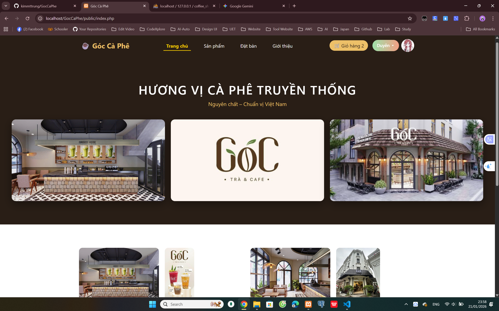
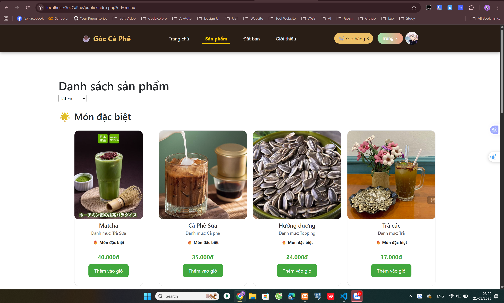
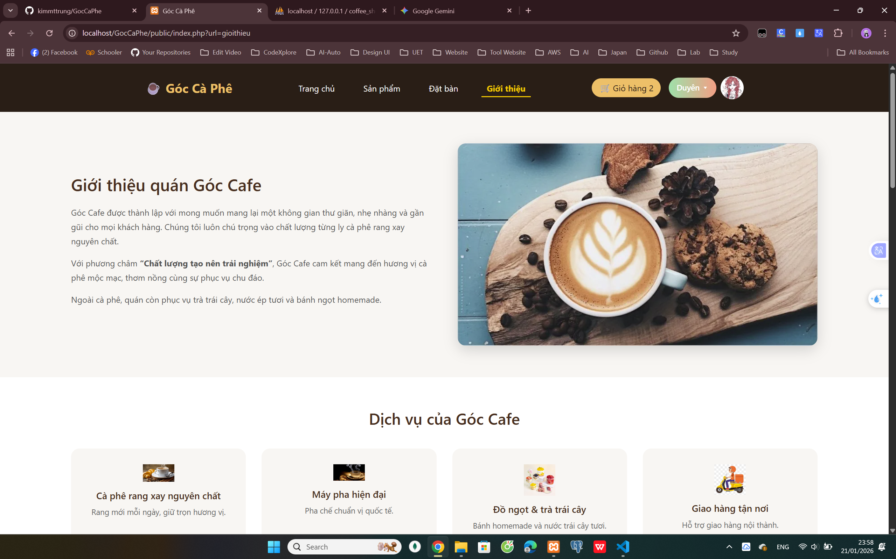
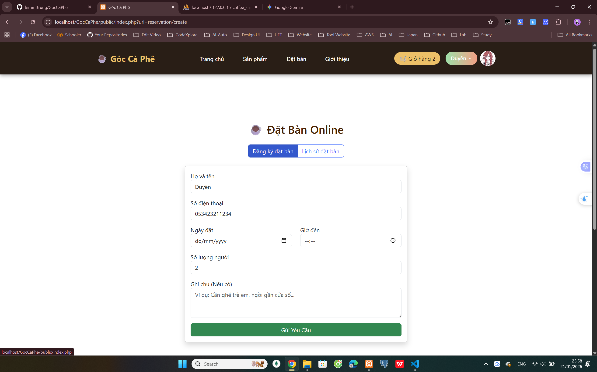
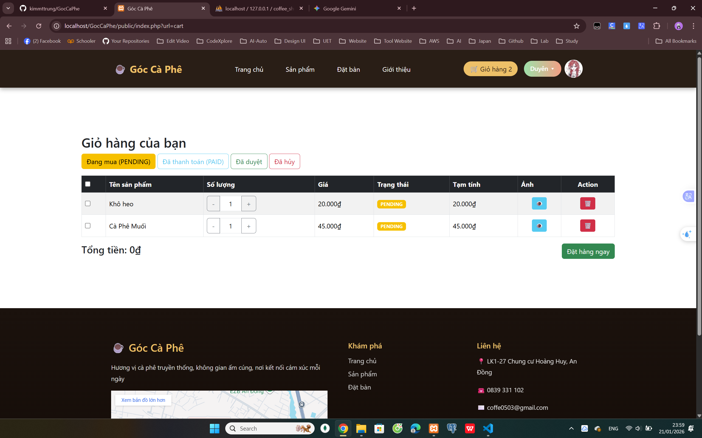
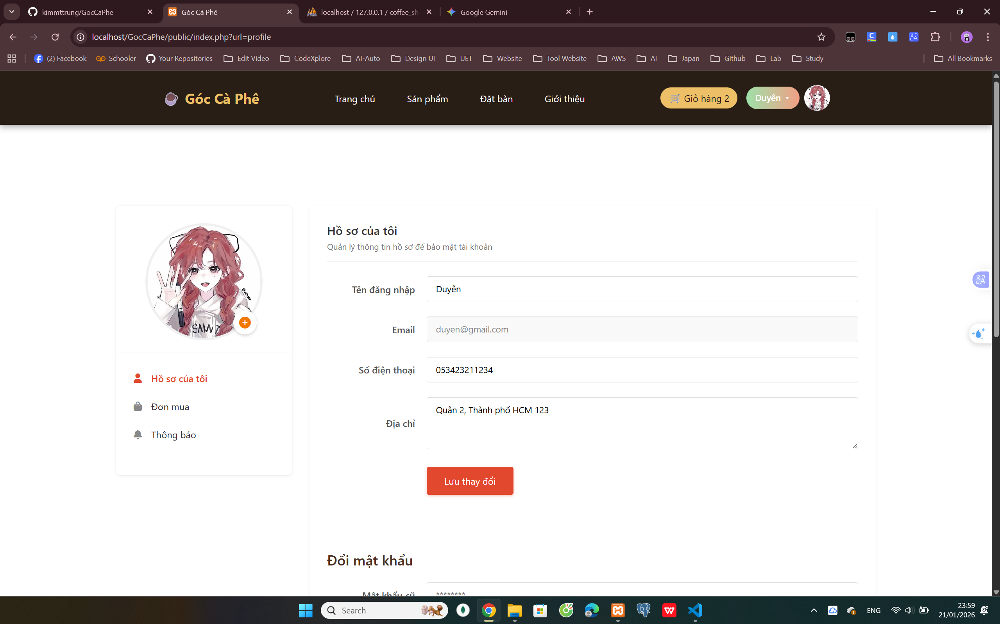

</div>

- 👷 Giao diện Nhân viên (Staff)

<div align="center"> 

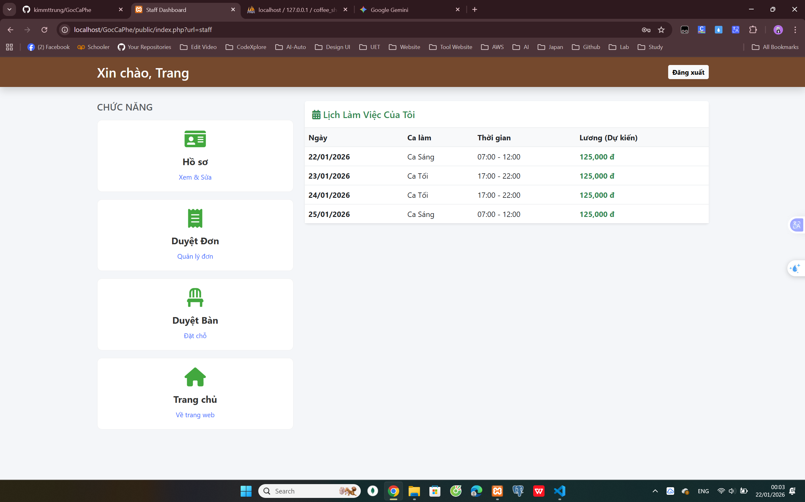

</div>

- 🔑 Giao diện Quản trị (Admin)
<div align="center"> 

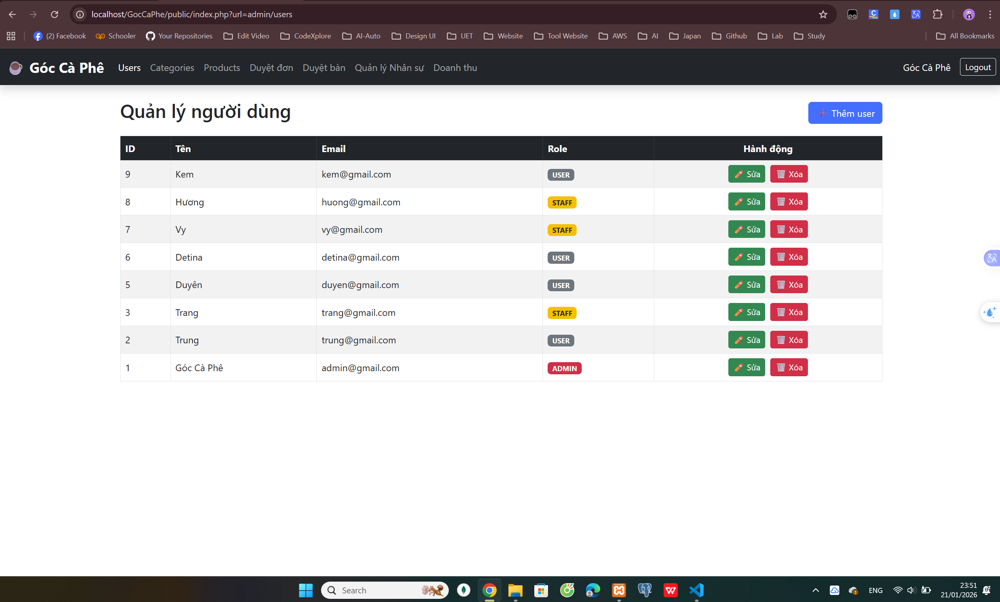
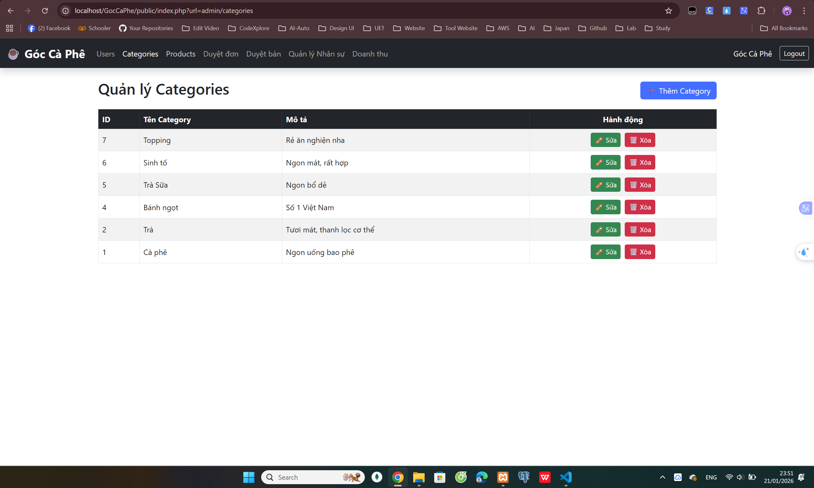
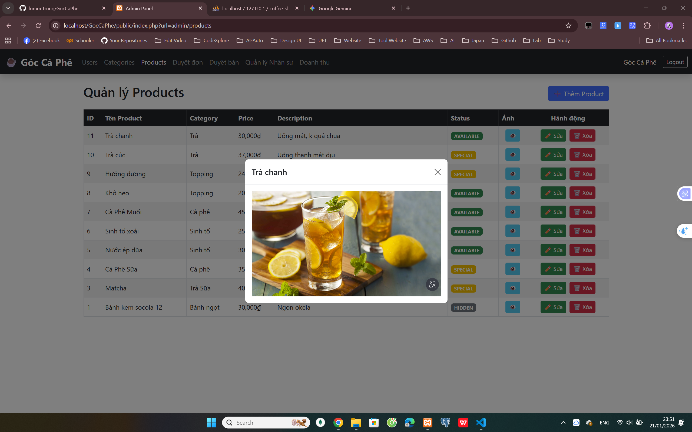
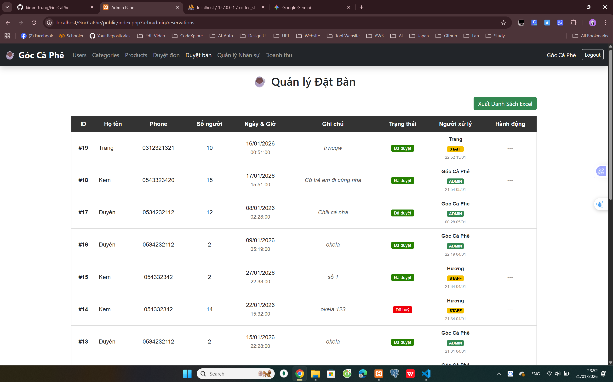
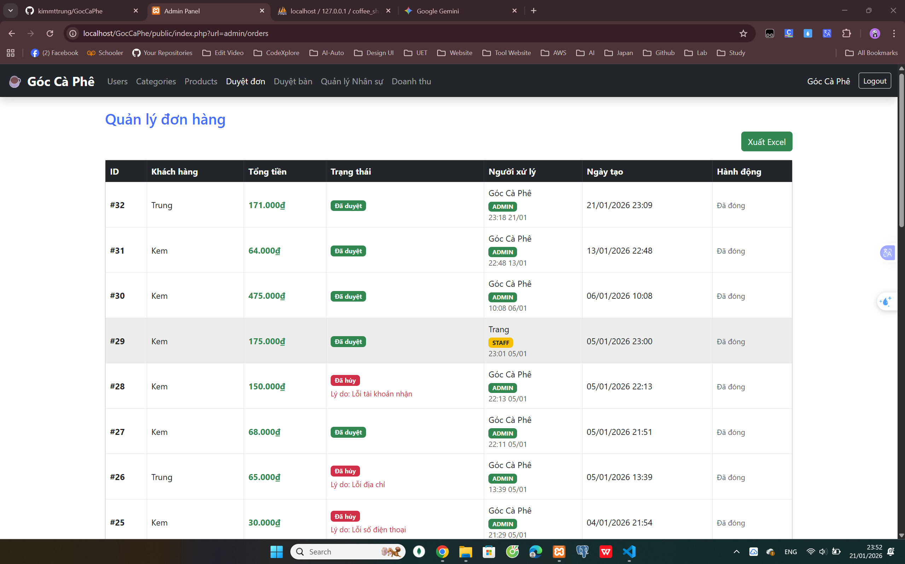
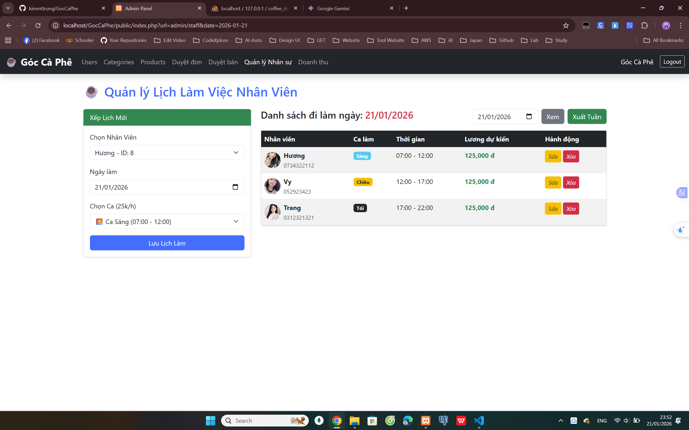
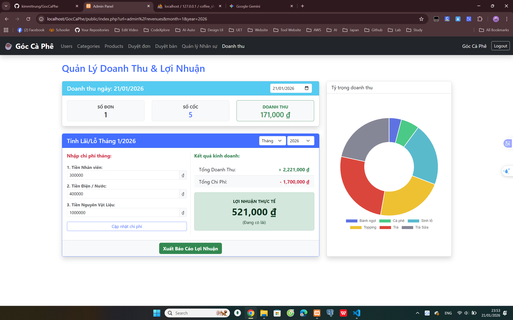

</div>

---

## ⚙️ Cài đặt & Chạy dự án <a id="install"></a>

### Yêu cầu

- PHP v8.x trở lên
- XAMPP (bao gồm Apache và MySQL) 
- Composer (để quản lý các gói Laravel)

### Bước cài đặt (Development)

```Bash

# 1. Clone project
git clone https://github.com/kimmttrung/GocCaPhe

# 2. Cài đặt các thư viện PHP
composer install

# 3. Cấu hình file .env
cp .env.example .env
# Chỉnh sửa thông số DATABASE_URL phù hợp với MySQL của bạn

# 4. Tạo khóa ứng dụng Laravel
php artisan key:generate

# 5. Khởi chạy Server
php artisan serve
```


## 📂 Cấu trúc thư mục <a id="structure"></a>
```bash
GocCafe_Website/
│── app/            # Chứa Controllers và Models (Logic xử lý nghiệp vụ) [cite: 401,403]
│── bootstrap/      # File cấu hình khởi động framework
│── config/         # Các file cấu hình hệ thống (DB, App, Auth...)
│── database/       # Chứa Migrations (Cấu trúc 8 bảng database) [cite: 517]
│── public/         # Chứa tài nguyên tĩnh (Images, CSS, JS) [cite: 407]
│── resources/
│   ├── views/      # Chứa các file giao diện (.blade.php) [cite: 402]
│── routes/         # Định nghĩa các đường dẫn web (Web routes)
│── storage/        # Lưu trữ file log và báo cáo Excel xuất ra [cite: 491]
│── .env            # Config biến môi trường và kết nối DB
│── package.json    # Quản lý các dependencies frontend
```

## 🚀 Cải tiến trong tương lai <a id="future-vi"></a>
- **Tích hợp thanh toán QR**: Hỗ trợ khách hàng thanh toán nhanh qua MoMo, VNPay.
- **Hệ thống thành viên**: Xây dựng chương trình tích điểm và ưu đãi cá nhân hóa cho khách hàng.
- **Thông báo thời gian thực**: Gửi thông báo ngay lập tức cho nhân viên khi có đơn hàng hoặc lịch đặt bàn mới.
- **Phân tích doanh thu**: Biểu đồ hóa dữ liệu kinh doanh hàng tháng để Admin dễ dàng theo dõi tiến độ.
- **Đa ngôn ngữ**: Hỗ trợ giao diện tiếng Anh và tiếng Nhật để mở rộng đối tượng khách hàng quốc tế. 
</details>

<details>
<summary><strong>日本語</strong></summary>


オンライン対応のカフェ管理・運営システム
お客様の席予約・注文をサポートし、管理者がスタッフやメニューを効率的に運営できるプラットフォーム

## 📚 目次
<summary>📖 クリックして表示</summary>

-  [🔗 リンク](#link1)
- [🚀 概要](#link2)
- [✨ 主な機能](#link3)
- [🛠 使用技術](#link4)
- [📸 デモ画像 / GIF](#link5)
- [⚙️ インストール & プロジェクト実行方法](#link6)
- [📂 ディレクトリ構成](#link7)
- [🚀 今後の改善予定](#link8)


## 🔗 リンク <a id="link1"></a>

-  デモ動画: [YouTube](https://www.youtube.com/watch?v=oxVCXuJaLV4&t=4s)

## 🚀 概要 <a id="link2"></a>

Góc Cafe Webサイトは、カフェの運営と顧客対応を効率化するためのプラットフォームです
以下のことを実現します

- 店舗の空間やサービス情報を分かりやすく提供
- ドリンク・フードメニューの閲覧
- オンラインでの席予約および注文によるユーザー体験の向上
- アカウント管理、スタッフ管理、勤務スケジュールの最適化

## ✨ 主な機能 <a id="link3"></a>
### 1️⃣ お客様向け（User）

- ホームページ閲覧：店舗紹介、雰囲気、キャンペーン情報
- オンライン席予約：人数や備考付きで事前予約
- 注文 & 支払い：カート管理、数量変更、オンライン決済

### 2️⃣ スタッフ向け（Staff）

- 注文処理：注文の確認・承認
- 席予約管理：空席確認および予約の承認・拒否
- 勤怠 & 給与管理：勤務スケジュールと給与の確認

### 3️⃣ 管理者向け（Admin）

- メニュー管理：カテゴリや商品（飲食）の追加・編集・削除
- スタッフ管理：権限設定、シフト（朝・昼・夜）の割り当て
- 統計・レポート：売上データ集計、Excel形式での出力

## 🛠 使用技術 <a id="link4"></a>

| 分類           | 技術 / ライブラリ                     |
| -------------- | ------------------------------------- |
| フロントエンド | HTML5 + CSS3 + JavaScript + Bootstrap |
| バックエンド   | PHP (v8.x) + Laravel Framework        |
| データベース   | MySQL (MariaDB)                       |
| サーバー       | XAMPP ローカルサーバー                |

---

## 📸 デモ画像 / GIF <a id="link5"></a>

- 👤 お客様画面（User）
<div align="center">


</div>

- 👷 スタッフ画面（Staff）

<div align="center"> 


</div>

- 🔑 管理者画面（Admin）
<div align="center"> 


</div>

---

## ⚙️ インストール & プロジェクト実行方法 <a id="link6"></a>

### 必要環境

- PHP v8.x 以上
- XAMPP（Apache・MySQL 含む）
- Composer（Laravel パッケージ管理） 

### セットアップ手順（開発環境）

```bash
# 1. プロジェクトをクローン
git clone https://github.com/kimmttrung/GocCaPhe

# 2. PHP ライブラリをインストール
composer install

# 3. .env ファイル設定
cp .env.example .env

# 4. Laravel アプリキー生成
php artisan key:generate

# 5. サーバー起動
php artisan serve

```

## 📂 ディレクトリ構成 <a id="link7"></a>
```bash
GocCafe_Website/
│── app/            # コントローラ・モデル（業務ロジック）
│── bootstrap/      # フレームワーク初期化設定
│── config/         # システム設定（DB, App, Auth）
│── database/       # マイグレーション（8 テーブル）
│── public/         # 静的リソース（画像, CSS, JS）
│── resources/
│   ├── views/      # Blade テンプレート
│── routes/         # Web ルーティング定義
│── storage/        # ログ・Excel レポート保存
│── .env            # 環境変数・DB 接続設定
│── package.json    # フロントエンド依存管理
```

## 🚀 今後の改善予定 <a id="link8"></a>
- QR 決済統合：MoMo、VNPay 対応
- 会員システム：ポイント・個別特典
- リアルタイム通知：新規注文・予約通知
- 売上分析：月次売上グラフ可視化
- 多言語対応：英語・日本語 UI 追加

</details>
<!-- <details>
<summary><strong>English</strong></summary>
</details> -->
